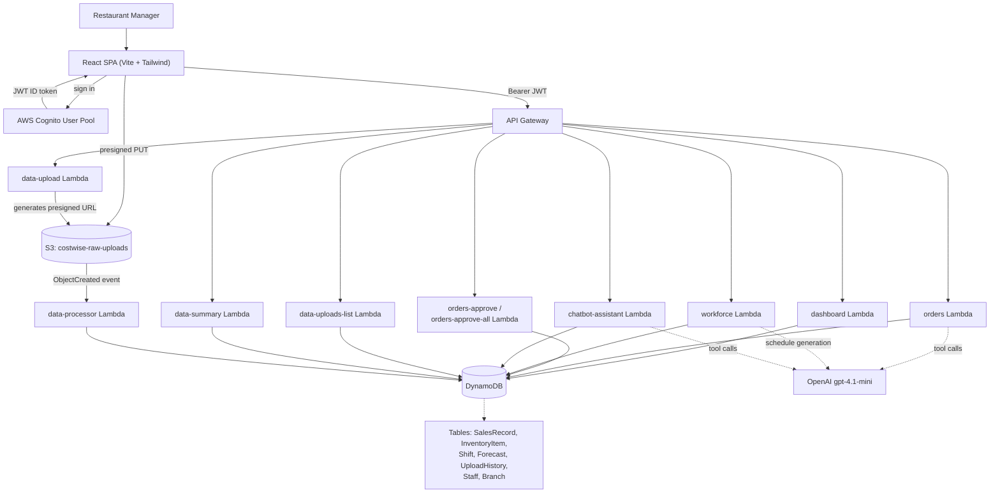

# CostWise


**Live app:** https://main.d63jofqtvwoud.amplifyapp.com

CostWise is an AI copilot for restaurant managers, built on AWS. It turns raw point-of-sale data into daily action: forecasting demand, recommending what to order and when, generating staff schedules around predicted foot traffic, and answering business questions in plain English through a chatbot — all backed by Cognito-authenticated APIs, DynamoDB, S3, and OpenAI's function-calling models.

## Features

- **Login** — Email/password authentication against an AWS Cognito User Pool via AWS Amplify Auth (including forced new-password flow on first sign-in); every subsequent API call carries the Cognito ID token as a Bearer JWT.
- **Dashboard** — Live daily KPIs (revenue, orders, average order value, active employees) with day-over-day trend deltas and a 7-day revenue chart, computed on each request by the `dashboard` Lambda directly from the `SalesRecord` and `Shift` DynamoDB tables.
- **Order Management** — AI inventory ordering: the `orders` Lambda runs an OpenAI (`gpt-4.1-mini`) agent loop that calls tools for current stock, 7-day sales history, and demand forecasts, then returns suggested order quantities with a priority (`high`/`medium`/`low`) and a short reasoning string per ingredient. Managers can add contextual "factors" (holiday, event, weather, weekend rush) and a free-text note that get passed into the prompt, then approve items individually or all at once.
- **Workforce Management** — AI shift scheduling: the `workforce` Lambda prompts OpenAI (`gpt-4.1-mini`) with the staff roster, last 7 days of sales, and live weather (OpenWeatherMap) and public-holiday (date.nager.at) data to generate a 7-day schedule, a predicted-customers-per-day forecast, and a labor-cost/understaffing summary.
- **Data Analysis** — CSV data ingestion: the browser requests a presigned S3 PUT URL from `data-upload`, uploads the CSV straight to the `costwise-raw-uploads` bucket, an S3 `ObjectCreated` event triggers `data-processor` to parse rows into `SalesRecord` and log an `UploadHistory` entry, and the page also shows a forecast-vs-actual comparison (`data-summary`) and upload history (`data-uploads-list`).
- **Chatbot Assistant** — A natural-language business chatbot: the `chatbot-assistant` Lambda runs an OpenAI (`gpt-4.1-mini`) agentic loop with 8 DynamoDB-backed tools (revenue, weekly revenue, week-over-week comparison, popular dishes, inventory status, low-stock items, active employees, pending orders) and multi-turn conversation history sent from the frontend.

## Architecture



## Tech stack

- **Frontend:** React 19, TypeScript, Vite, Tailwind CSS v4, React Router, Recharts, react-markdown, AWS Amplify (Cognito Auth), lucide-react
- **Backend:** AWS Lambda (Python, boto3), API Gateway with a Cognito authorizer, DynamoDB, S3 (presigned uploads + `ObjectCreated` event trigger)
- **AI:** OpenAI API (`gpt-4.1-mini`) for tool-calling agent loops (orders, chatbot) and JSON schedule generation (workforce)
- **Hosting/CI:** AWS Amplify Hosting for the SPA, GitHub Actions for build checks

## Repository layout

```
frontend/               React + Vite SPA — pages (Login, Dashboard, Orders, Workforce,
                         DataAnalysis, Chatbot), hooks, Cognito auth (src/lib/auth.ts),
                         API base URL config (src/config.ts)
backend/functions/      12 Lambda handlers: dashboard, orders, orders-approve,
                         orders-approve-all, workforce, workforce-approve, chatbot-assistant,
                         data-upload, data-processor, data-summary, data-uploads-list, health
docs/                   API contract (docs/api-contract.md) and design/planning docs
                         (docs/plans/)
scripts/                seed_data.py — seeds DynamoDB with demo data (Branch, Staff,
                         InventoryItem, SalesRecord, Shift, Forecast)
```

## Running locally

### Frontend

Create `frontend/.env.local` (never commit real values):

```
VITE_USER_POOL_ID=us-east-1_XXXXXXXXX
VITE_USER_POOL_WEB_CLIENT_ID=xxxxxxxxxxxxxxxxxxxxxxxxxx
VITE_API_BASE=https://xxxxxxxxxx.execute-api.us-east-1.amazonaws.com/dev
```

These are the exact variables read by the app (`frontend/src/main.tsx` configures Amplify's Cognito Auth from `VITE_USER_POOL_ID` / `VITE_USER_POOL_WEB_CLIENT_ID`; `frontend/src/config.ts` reads `VITE_API_BASE` for every API call).

Then:

```bash
cd frontend
npm ci
npm run dev
```

### Backend

The Lambdas in `backend/functions/` are deployed to AWS (API Gateway + Lambda + DynamoDB + S3 + Cognito) and are not runnable as a local server. To seed the DynamoDB tables with demo data for a fresh environment, run:

```bash
python scripts/seed_data.py
```

(requires AWS credentials configured for the target account/region).

## Documentation

- [`docs/api-contract.md`](docs/api-contract.md) — full request/response contract for every endpoint
- [`docs/plans/`](docs/plans/) — design and planning docs (chatbot upgrade, branch reconciliation)
- [`CONTRIBUTING.md`](CONTRIBUTING.md) — branch workflow and commit conventions
